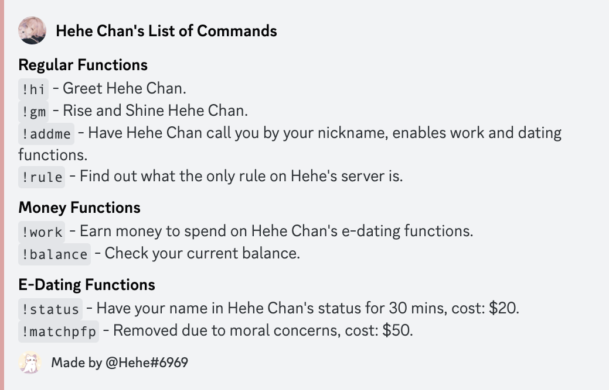

# Typescript x Python E-Girl Discord Bot

A Discord bot that is equipped with multiple chat functions for both guilds and dms.

## Initial setup

Run the following command in your terminal

```bash
  git clone https://github.com/HARI-PRMD/discord-bot.git
  cd discord-bot
  source setup.sh
```

> This will Install all the packages needed for the python ai component
> as well as the typescript components in an environment.

If your results aren't as accurate you can re-train the bot until you get a lower
final loss.

```bash
  source train.sh
```

## Functions

type `!help` in a server to get a full list of guild functions.


Apart from this you can train the bot by updating intents in the following way:

```json
{
  "tag": "Greetings",
  "patterns": [
    "Hello",
    "Hi",
    "Wassup",
  ],
  "responses": [
    "Hello there!",
    "👋"
  ]
},
```
